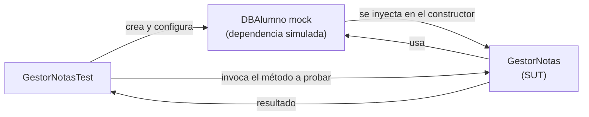

# Ejercicios Tema 1.2: Pruebas unitarias

---

# Casos de Test
## Ejercicio 1
- Implementa varios tests de la clase `Complex`
- Comprueba que el complejo `Complex(0, 0)` tiene parte real y parte imaginaria 0.
- Comprueba que `Complex(0, 0)` es el valor neutro de la operación suma:
    - `Complex(0, 0) + Complex(1, 1) == Complex(1, 1)`
    - `Complex(1, 1) + Complex(0, 0) == Complex(1, 1)`

---

## Ejercicio 2
- Transforma el Ejercicio 1 para usar Test fixtures
- Define un atributo `zero` que se inicializa en un método setUp anotado como `@BeforeEach`
- Ese atributo se usará siempre que se necesite el número complejo 0+0i:
    - `zero + Complex(1, 1) == Complex(1, 1)`
    - `Complex(1, 1) + zero == Complex(1, 1)`

---

# Dobles
## Ejercicio 8: GestorNotas
- Queremos testear la clase **GestorNotas** que permite obtener la nota media de los alumnos
- Obtiene los alumnos de una **BaseDatosAlumnos** configurada en el constructor
- Usa el método **baseDatos.getNotasAlumno(id)** para obtener las notas de un alumno (en forma de array) para calcular su nota media

---

<<< @/code/ejer8/src/main/java/es/codeurjc/test/gestor/GestorNotas.java[7-24] java
[!mark:"public GestorNotas(DBAlumno alumnos)"] Inyecta la dependencia de la base de datos
[!mark:"getNotasAlumno(idAlumno)"] Obtiene las notas del alumno
[!mark:"float suma = 0.0f;".."return suma / notas.size();"] Recorre las notas para sumarlas

---

## Ejercicio 8: Solución con mock

- El test crea un **mock** de `DBAlumno` y define qué debe devolver `getNotasAlumno(id)`
- El mock se pasa al constructor de `GestorNotas` (System Under Test)
- Así el test no depende de una base de datos real