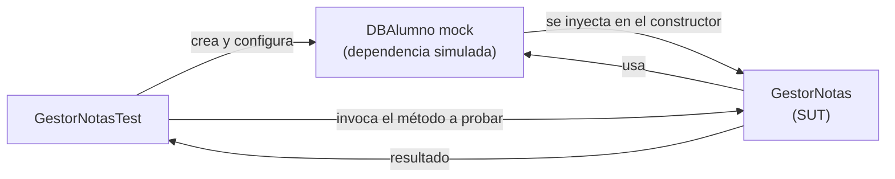

# Tutorial: Nuevas funcionalidades de codeurjc-slidev

---

# Editor visual de layout
- Cada slide con el layout `default` incluye una capa de edición integrada en el panel **SideEditor** de Slidev (pestaña "Layout")
- Arrastra y redimensiona la barra roja, el logo, el título y el contenido
- Los cambios se pueden deshacer (undo) antes de guardar
- Al guardar, la posición se persiste como variables CSS en el propio `.vue` del layout, o se puede guardar como un layout `.vue` nuevo

---

# Auto-fit del tamaño de texto
- El contenido de cada slide ajusta automáticamente su tamaño de letra para caber en la caja de contenido
- Si el texto cabe de sobra, se mantiene un tamaño cómodo por defecto (no crece innecesariamente)
- Si el texto es demasiado largo, se reduce progresivamente hasta encajar
- Se recalcula también si el tamaño de la caja de contenido cambia (p. ej. al arrastrarla con el editor)

---

# Pegar y posicionar imágenes
- Pega una imagen (Ctrl+V) directamente sobre una slide en modo edición
- La imagen se sube automáticamente y se inserta como `` en el markdown de la slide, sin pipeline manual de assets
- Se puede elegir la posición de la imagen respecto al contenido:
    - **Debajo** del texto (`below`): la imagen se centra bajo el contenido
    - **A la derecha** del texto (`right`): el contenido se estrecha para dejar hueco a la imagen
- La imagen es un elemento más del editor de layout: se puede arrastrar, redimensionar y su posición se guarda igual que el resto

---

# Doble clic para editar texto
- Haz doble clic sobre el título o el contenido ya renderizado de una slide
- El editor salta automáticamente al markdown de esa slide y selecciona el texto pulsado
- Permite pasar directamente de "veo un error en la slide" a "lo edito", sin buscar manualmente la línea en el markdown

---

# Anotaciones de código: callouts
- Permiten marcar una línea, un rango de líneas o una subcadena dentro de un bloque de código
- Cada marca puede llevar un comentario que se renderiza como una caja (callout) conectada al código mediante un conector en L
- Las marcas se escriben como comentario al final de la línea de código y **se eliminan del código renderizado**: el público nunca las ve

---

# Anotaciones de código: sintaxis
```
// [!mark[:start|:end][(<inicio>-<fin>)][@<x>,<y>]] <comentario>
```
- No hace falta id: las marcas no se referencian entre sí, así que no se escribe ninguno (se genera internamente solo para uso interno)
- `<comentario>`: todo lo que va después del `]`; si se deja vacío, la línea se resalta pero no aparece ninguna caja
- Formas disponibles:
    - Línea completa: `// [!mark] comentario`
    - Rango multilínea: `// [!mark:start]` ... `// [!mark:end]`
    - Subcadena: `// [!mark(<inicio>-<fin>)] comentario`, con `<inicio>`/`<fin>` como índices de carácter (base 0, fin exclusivo) sobre la línea de código
    - Posición fija: `@x,y` justo antes del `]` (se escribe solo al arrastrar el callout en el editor)

---

# Anotaciones de código: ejemplo
```java
public GestorNotas(DBAlumno alumnos) { // [!mark] Inyecta la dependencia de la base de datos
	this.alumnos = alumnos;              // [!mark(1-13)] Solo la subcadena
}

public float calculaNotaMedia(long idAlumno) {
	List<Float> notas = alumnos.getNotasAlumno(idAlumno); // [!mark(29-53)] Obtiene las notas del alumno
	float suma = 0.0f; // [!mark:start] Recorre las notas para sumarlas
	for(float nota : notas) {
		suma += nota;
	}
	return suma / notas.size(); // [!mark:end]
}
```

---

# Anotaciones de código: colocación y arrastre
- Los callouts se colocan automáticamente alrededor del bloque de código: **derecha → izquierda → debajo → encima**, el primer lado donde quepan
- Se dimensionan según el texto del comentario (con un ancho máximo, creciendo en alto si hace falta)
- Si un lado ya está ocupado por otro callout del mismo bloque, el nuevo se apila junto al hueco libre más cercano a su propio resaltado
- En modo edición, arrastrar un callout escribe su posición como `@x,y` en la marca, para que persista entre recargas y sobreviva a ediciones posteriores del código

---

# Importar código desde ficheros
- Antes había que copiar y pegar el código de ejemplo dentro de `slides.md`
- Ahora se puede referenciar directamente un fichero del directorio `code/` (proyectos de ejercicios/ejemplos, ejecutables de verdad)
- El fichero se lee en vivo y **se vuelve a renderizar si cambia**
- El fichero referenciado queda completamente limpio: nunca se le añade ninguna marca ni sintaxis propia de la slide

---

# Importar código: sintaxis
```
<<< @/code/ruta/al/Fichero.java[selector] lang
```
- Sin selector: se muestra el fichero completo
- `[N-M]`: rango de líneas absoluto (base 1, ambos inclusive)
- `["primera línea".."última línea"]`: rango por contenido — desde la línea que contiene el primer texto hasta la que contiene el segundo, ambos inclusive
    - Si no se encuentra alguno de los anclajes, se muestra el fichero completo (con aviso por consola)
- Existe una convención de "raíz de código" (`code/` por defecto): un import que resuelva fuera de ahí solo genera un aviso por consola, no rompe el build
- El bloque de código muestra automáticamente una barra de título con el nombre del fichero (p. ej. `GestorNotas.java`)
    - Para ocultarla, añade `notitle` después del lenguaje: `<<< @/code/ruta/al/Fichero.java[selector] lang notitle`

---

# Importar código: resaltados con anclajes
- El fichero importado no puede llevar comentarios `// [!mark]`, así que los resaltados se declaran en `slides.md`, justo debajo del `<<<`, uno por línea
- Referencian el snippet ya recortado (tal como se ve en la slide), no el fichero completo:
    - `[!mark:N] comentario` — línea `N`
    - `[!mark:N..M] comentario` — rango de líneas
    - `[!mark:"texto"] comentario` — la subcadena `texto` (búsqueda literal)
    - `[!mark:"texto"(<inicio>-<fin>)] comentario` — subcadena `[<inicio>, <fin>)` de la línea encontrada
    - `[!mark:"a".."b"] comentario` — desde la línea de `a` hasta la de `b`
    - `[!mark:"a"+N] comentario` — desde la línea de `a` hasta `N` líneas después
    - `#N` / `#*` al final de un anclaje por contenido: elige la ocurrencia N-ésima, o resalta todas las ocurrencias
- Igual que con las marcas inline, `@x,y` fija la posición y se escribe solo al arrastrar el callout

---

# Importar código: ejemplo
```
<<< @/code/ejer8/src/main/java/es/codeurjc/test/gestor/GestorNotas.java[7-24] java
[!mark:"public GestorNotas(DBAlumno alumnos)"] Inyecta la dependencia de la base de datos
[!mark:"getNotasAlumno(idAlumno)"] Obtiene las notas del alumno
[!mark:"float suma = 0.0f;".."return suma / notas.size();"] Recorre las notas para sumarlas
```
- Muestra las líneas 7 a 24 de `GestorNotas.java` tal cual están en el proyecto real
- Los tres resaltados y sus callouts se calculan sobre ese fragmento, sin tocar el fichero fuente
- La barra de título ("GestorNotas.java") aparece sola, sin escribir nada extra en la slide

---

# Diagramas mermaid centrados
- Los bloques ```` ```mermaid ```` ahora se centran y ocupan un ancho legible por defecto en el layout `default`, sin necesidad de markup extra en cada slide
- Antes, el host ShadowRoot de mermaid se renderizaba encogido a su contenido, así que el `width: 100%` interno del svg se resolvía contra ese tamaño diminuto y el diagrama salía muy pequeño
- Ahora ese host tiene un ancho fijo y centrado (`margin: 0 auto`), y el propio `max-width` inline de mermaid sigue evitando que diagramas pequeños se estiren de más

---

# Diagramas mermaid: ejemplo


---

# Título y subtítulo heredados
- Si una slide con layout `default` no empieza por `# Título`, hereda el título de la slide anterior que sí lo tuviera
- El subtítulo (`## ...`) se hereda igual, pero de forma **independiente**: una slide puede cambiar solo el subtítulo y mantener el título, o al revés
- Evita copiar y pegar el mismo `# Título` en cada slide de una misma sección
- Una slide con layout distinto de `default` (p. ej. `cover`) no interrumpe la herencia: se salta al buscar la slide anterior

---

# Título heredado: cómo cortar la herencia
- Una marca vacía (`#` o `##`, sin texto) corta la herencia desde esa slide en adelante, hasta que otra slide ponga un título/subtítulo nuevo
- También se puede usar `resetTitle: true` en el frontmatter de una slide para cortar **ambas** herencias (título y subtítulo) a la vez, sin escribir las marcas vacías

---

# Herencia de título
## Ejemplo: primera parte
- Esta slide fija el título ("Herencia de título") y el subtítulo ("Ejemplo: primera parte")
- La siguiente slide de este mismo fichero no repite `# Herencia de título`

---

## Ejemplo: segunda parte
- Fíjate en el título de esta slide: sigue siendo "Herencia de título", heredado de la anterior
- Solo se ha escrito `## Ejemplo: segunda parte` — el título no se ha vuelto a escribir

---

# Empezar un proyecto nuevo
- Ya no hace falta clonar este repositorio para crear una presentación con el tema de CodeURJC
- El tema y el CLI de scaffolding están publicados en npm:
    - [`codeurjc-slidev-theme`](https://www.npmjs.com/package/codeurjc-slidev-theme) — el tema en sí (`theme: codeurjc-slidev-theme`)
    - [`create-codeurjc-slidev`](https://www.npmjs.com/package/create-codeurjc-slidev) — CLI que genera un proyecto nuevo desde cero

---

# Empezar un proyecto nuevo: pasos
```sh
pnpm create codeurjc-slidev mi-charla
cd mi-charla
pnpm install
pnpm dev
```
- El CLI pregunta el nombre del proyecto (si no se pasa como argumento) y si quieres instalar/arrancar el dev server al terminar
- Genera un proyecto mínimo y autocontenido: `package.json`, `slides.md`, `code/` (vacío) y `public/images/logo.png`
- No hace falta ningún `vite.config.ts` local: la dependencia `codeurjc-slidev-theme` aporta el layout, el editor y todas las funcionalidades de este tutorial
- También funciona con `npm create codeurjc-slidev` o `yarn create codeurjc-slidev`

---
layout: copyright
---

# Tutorial: Nuevas funcionalidades de codeurjc-slidev
