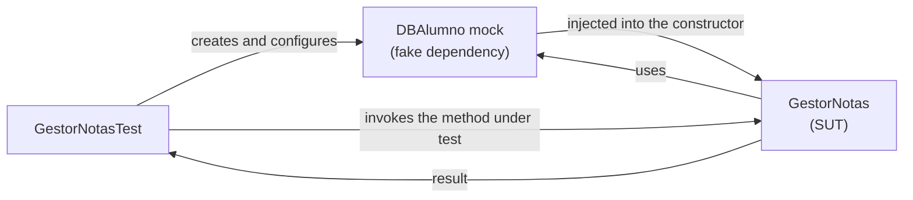

# Tutorial: codeurjc-slidev

---

# Starting a new project
- Create a presentation with the CodeURJC theme
- The theme and the scaffolding CLI are published on npm:
    - [`codeurjc-slidev-theme`](https://www.npmjs.com/package/codeurjc-slidev-theme) — the theme itself (`theme: codeurjc-slidev-theme`)
    - [`create-codeurjc-slidev`](https://www.npmjs.com/package/create-codeurjc-slidev) — a CLI that scaffolds a new project from scratch

---

# Starting a new project: steps
```sh
pnpm create codeurjc-slidev my-talk
cd my-talk
pnpm install
pnpm dev
```
- The CLI asks for the project name (if not passed as an argument) and whether to install dependencies and start the dev server
- It generates a minimal, self-contained project: `package.json`, `slides.md`, an empty `code/` directory, and `public/images/logo.png`
- Also works with `npm create codeurjc-slidev` or `yarn create codeurjc-slidev`

---

# Importing an ODP presentation
```sh
pnpm create codeurjc-slidev tema-1-2 --from-odp "Tema 1.2 - Pruebas unitarias.odp"
```
- Converts a LibreOffice Impress deck into a new project, one project per ODP
    - Without arguments, the CLI asks whether to start from an empty project or from an ODP
- `--code <dir>`: the code folder the slides show. By default, the folder next to the ODP with the same name. It's copied into `code/`, never cloned
- `--code-repo <url>`: GitHub URL for source links. By default, the code folder's own GitHub `origin`

---

## What gets converted
- Every slide, in order: hidden slides keep `hide: true`, and cover/copyright slides use the theme's layouts
- Titles are written only where they change, relying on title inheritance. A two-line title becomes title + subtitle
- Bullet lists, bold, italic, inline code, links and tables
- Images are copied into `public/images/` and placed with per-slide `geometry` frontmatter
- Code that matches a file in the code folder becomes a `<<<` import; other code stays inline. Highlight boxes and callouts drawn over code become code annotations
- Build-ups (consecutive slides that only add a callout, a bullet or an image) become one slide with click steps

---

## What can't be converted
- The import is a best effort: arrows, diagrams, grouped shapes, callouts over screenshots... are listed in the console, never written into `slides.md`
- With **LibreOffice ≥ 7.4** installed, the import also writes `comparison.md`: for each slide that lost something, the original slide next to its list of losses, followed by the converted slide
    - Open it with `pnpm run dev:compare`
- The project's `export` script is `slidev export --with-clicks`, so the PDF keeps every click step

---

# The CodeURJC theme
##
- Every slide gets the CodeURJC look for free: red bar, logo, and title styling, with no setup beyond `theme: codeurjc-slidev-theme`
- Comes with an `urjc-red` / `urjc-green` UnoCSS color preset, so custom elements you add can match the theme's palette
- The rest of this tutorial covers the authoring features layered on top of that base theme

---

# Inherited titles and subtitles
- On a slide using the `default` layout, if it doesn't start with `# Title`, that title is inherited from the nearest preceding slide that set one
- The subtitle (`## ...`) is inherited the same way, but **independently**: a slide can change only the subtitle and keep the title, or vice versa
- Avoids retyping the same `# Title` on every slide of a section
- A slide with a different layout (e.g. `cover`) doesn't interrupt inheritance: it's skipped over when looking for the previous slide

---

# Inherited titles: cutting the chain
- An empty heading (bare `#` or `##`, no text) cuts inheritance from that slide onward, until another slide sets a new title/subtitle
- `resetTitle: true` in a slide's frontmatter cuts **both** chains (title and subtitle) at once, without writing the empty headings

---

# Title inheritance
## Example: first part
- This slide sets the title ("Title inheritance") and the subtitle ("Example: first part")
- The next slide in this same file doesn't repeat `# Title inheritance`

---

## Example: second part
- Notice the title of this slide: it's still "Title inheritance", inherited from the previous one
- Only `## Example: second part` was written — the title wasn't retyped

---

# Auto-fit text size
##
- A slide's content automatically adjusts its font size to fit the content box
- If the text fits comfortably, a default comfortable size is kept (it doesn't grow needlessly)
- If the text is too long, it shrinks progressively until it fits
- It's recalculated whenever the content box's size changes (e.g. when dragging it in the editor)

---

# Pasting and positioning images
- Paste an image (Ctrl+V) directly onto a slide in edit mode
- The image is uploaded automatically and inserted as `` in the slide's markdown — no manual asset pipeline
- You can choose the image's position relative to the content:
    - **Below** the text: the content shrinks towards its text and the image is centered under it, always inside the slide
    - **To the right** of the text: the content narrows to make room for the image
- The choice is written to the slide's own `geometry` frontmatter (next slide), so it works for any number of pasted images and never creates a new layout
- Until you choose, the image stays in the normal flow of the text; afterwards it can be dragged and resized from the Layout tab

---

# Positioning content and images per slide
- A `default`-layout slide can place its own content box and any number of images from its frontmatter, without creating a new layout
```yaml
geometry:
  content: {x: 31, y: 98, w: 520, h: 424}
  images:
    - {x: 590, y: 110, w: 350, h: 190}
    - {x: 590, y: 320, w: 350, h: 190}
```
- Coordinates are slide pixels, the same ones the layout editor shows (the slide is 980 px wide)
- `content` moves only this slide's content box; `images[N]` places the Nth image of the slide, scaled without distortion
- Images without an entry stay in the normal flow

---
geometry:
  content: {x: 31, y: 98, w: 520, h: 424}
  images:
    - {x: 590, y: 110, w: 350, h: 190}
    - {x: 590, y: 320, w: 350, h: 190}
---

## Example
- This slide's own frontmatter is the `geometry` example from the previous slide
- Its text is narrowed to the left with `geometry.content`
- Both images are placed on the right with `geometry.images`, in the order they appear in the markdown
- In edit mode, the Layout tab lists them as "Content (this slide)" and "Image N (this slide)": dragging them rewrites this slide's frontmatter, never the layout


---

# Slide callouts
##
- Point a callout at anything on a slide -- a spot on an image, a line of content, or a bare point -- from the slide's own `callouts` frontmatter
- `at` says what it points at: `{image: /images/pic.png, x, y}` (fractions of that picture, named by its `src`; add `#2` for its second copy), `{x, y}` (slide pixels) or `{text: ...}` (the element containing that text)
- No `text` gives an arrow with no box; a `box` placed over its own anchor gives a label with no arrow
- `step: N` reveals it at click N, like `{N}` on code marks; `step: 2-4` or `step: -1` is a range, as on code marks
- In edit mode, **+ Callout** in the Layout tab (or Alt+click) creates one: click what it should point at, then type

---
geometry:
  content: {x: 31, y: 98, w: 380, h: 424}
  images:
    - {src: /images/URJC.jpg, x: 440, y: 150, w: 500, h: 222}
callouts:
  - at: {image: /images/URJC.jpg, x: 0.15, y: 0.5}
    text: The URJC logo
    box: {x: 470, y: 420}
  - at: {image: /images/URJC.jpg, x: 0.62, y: 0.35}
    step: 1
---

## Example
- This slide's text is narrowed with `geometry.content`, and its image placed with `geometry.images`
- The first callout points at the logo, a fraction of the way into the picture named by its `src`, so it follows the image if it moves and still finds it if another image is added before it
- Click once: the second callout, which has no text, appears as a bare arrow


---

# Centered mermaid diagrams
##
- ` ```mermaid ` blocks are centered and use a readable default width in the `default` layout, with no extra markup needed on each slide

---

# Mermaid diagrams: example


---

# Double-click to edit text
- Double-click a slide's already-rendered title or content
- The editor automatically jumps to that slide's markdown and selects the clicked text
- Lets you go straight from "I see a mistake on this slide" to "I'm editing it", without manually hunting for the line in the markdown

---

# Code annotations: callouts
- Mark a line, a line range, or a substring inside a fenced code block
- Each mark can carry a comment that renders as a callout box connected to the code by an elbow connector
- Marks are written as a trailing comment on the code line and **are stripped from the rendered code**: the audience never sees them

---

# Code annotations: syntax
```
// [!mark[:start|:end][(<start>-<end>)][{<step>}][@<x>,<y>]] <comment>
```
- No id needed: marks aren't referenced by anything else, so none is written (one is generated internally, for internal use only)
- `<comment>`: everything after the `]`; if left empty, the line is still highlighted but no box appears
- Available forms:
    - Whole line: `// [!mark] comment`
    - Multi-line range: `// [!mark:start]` ... `// [!mark:end]`
    - Substring: `// [!mark(<start>-<end>)] comment`, with `<start>`/`<end>` as character indices (0-based, end-exclusive) into the code line
    - Click step: `{N}`, e.g. `// [!mark{2}] comment` (see "click steps" below)
    - Several markers in one comment: each comment ends where the next marker starts, so `// [!mark:end] [!mark:end]` closes two ranges (the inner one first)
    - Fixed position: `@x,y` right before the `]` (written automatically when you drag the callout in the editor)

---

# Code annotations: example
```java
public GestorNotas(DBAlumno alumnos) { // [!mark] Injects the database dependency
	this.alumnos = alumnos;              // [!mark(1-13)] Just the substring
}

public float calculaNotaMedia(long idAlumno) {
	List<Float> notas = alumnos.getNotasAlumno(idAlumno); // [!mark(29-53)] Fetches the student's grades
	float suma = 0.0f; // [!mark:start] Loops through the grades to sum them
	for(float nota : notas) {
		suma += nota;
	}
	return suma / notas.size(); // [!mark:end]
}
```

---

# Code annotations: several markers on one line
```yaml
name: Continuous integration example # [!mark:start] The whole workflow
on: push
jobs:
  test: # [!mark:start] One job of it
    runs-on: ubuntu-latest
    steps:
      - uses: actions/checkout@v6
      - run: mvn test # [!mark:end] [!mark:end]
```
- Both ranges end on the same line, so that line carries two `:end` markers
- They close innermost-first, exactly like closing brackets
- A comment ends where the next marker starts, so it can't itself contain `[!mark`

---

# Code annotations: placement and dragging
- Callouts are placed automatically around the code block: **right → left → below → above**, the first side that fits
- They're sized according to the comment text (with a max width, growing taller if needed)
- If a side is already occupied by another callout on the same block, the new one stacks next to the closest free spot to its own highlight
- In edit mode, dragging a callout writes its position as `@x,y` into the mark, so it persists across reloads and survives later edits to the code above it

---

# Callout styles
- By default a callout is an **arrow**: a straight line from the highlight into its box, with the arrowhead on the box
    - Boxes on the same side follow the order of their highlights, so the arrows don't cross
- `calloutStyle: elbow` in a slide's frontmatter brings back the L-shaped line with the arrowhead on the code
- For the whole deck, set it in the first slide's frontmatter: `defaults: { calloutStyle: elbow }`; a slide's own `calloutStyle` still wins
- The style applies to code callouts and slide callouts alike

---
calloutStyle: elbow
---

## Elbow example
```java
public GestorNotas(DBAlumno alumnos) { // [!mark] The same callout, drawn as an elbow
	this.alumnos = alumnos;
}
```

---

# Code annotations: click steps
- Add `{N}` to a mark to reveal it step by step: the highlight, its callout and its connector appear at click `N` and stay visible
    - It goes after the range or substring and before `@x,y`: `// [!mark{2}]`, `// [!mark:start{3}]`, `// [!mark(2-16){2}@120,40]`
- Several marks can share a step, so they appear together; marks without a step are always visible
- A range makes a mark disappear again: `{2-3}` is visible at clicks 2 and 3, `{-1}` from the start through click 1, `{-0}` only before the first click
    - Walking through code one line at a time is `{-0}`, `{1-1}`, `{2}`
- Callouts are placed once for every click, so revealing or hiding a step never moves the callouts shown; callouts that are never visible together don't push each other away
- In edit mode every callout is visible, to drag them freely
- `slidev export --with-clicks` exports each step as its own page

---

## Example (click to advance)
```java
public GestorNotas(DBAlumno alumnos) { // [!mark] Always visible: injects the database dependency
	this.alumnos = alumnos;
}

public float calculaNotaMedia(long idAlumno) {
	List<Float> notas = alumnos.getNotasAlumno(idAlumno); // [!mark(29-53){1}] Click 1: fetches the student's grades
	float suma = 0.0f; // [!mark:start{2}] Click 2: loops through the grades to sum them
	for(float nota : notas) {
		suma += nota;
	}
	return suma / notas.size(); // [!mark:end]
}
```

---

## Walk-through (click to advance)
```java
public float calculaNotaMedia(long idAlumno) {
	List<Float> notas = alumnos.getNotasAlumno(idAlumno); // [!mark{-0}] First the grades are fetched
	float suma = 0.0f; // [!mark{1-1}] then summed
	return suma / notas.size(); // [!mark{2}] and averaged
}
```

---

# Importing code from files
##
- Reference a file from the `code/` directory (real, runnable exercise/example projects) directly on a slide
- The file is read live and **re-rendered whenever it changes**
- The referenced file stays completely clean: no mark or slide-only syntax is ever added to it

---

# Importing code: syntax
```
<<< @/code/path/to/File.java[selector] lang
```
- No selector: shows the whole file
- `[N-M]`: absolute line range (1-based, both inclusive)
- `["first line".."last line"]`: content range — from the line containing the first text through the line containing the second, both inclusive
    - If either anchor isn't found, the whole file is shown instead (with a console warning)
- There's a "code root" convention (`code/` by default): an import resolving outside it only produces a console warning, it doesn't break the build
- The code block automatically shows a title bar with the file's name (e.g. `GestorNotas.java`)
    - To hide it, add `notitle` after the language: `<<< @/code/path/to/File.java[selector] lang notitle`

---

# Importing code: highlights via anchors
- The imported file can't carry `// [!mark]` comments, so highlights are declared in `slides.md`, right below the `<<<` import, one per line
- They target the already-sliced snippet (as shown on the slide), not the whole file:
    - `[!mark:N] comment` — line `N`
    - `[!mark:N..M] comment` — line range
    - `[!mark:"text"] comment` — the substring `text` (literal search)
    - `[!mark:"text"(<start>-<end>)] comment` — substring `[<start>, <end>)` of the matched line
    - `[!mark:"a".."b"] comment` — from the line containing `a` through the line containing `b`
    - `[!mark:"a"+N] comment` — from the line containing `a` through `N` lines after it
    - `#N` / `#*` at the end of a content anchor: picks the Nth occurrence, or highlights every occurrence
    - `{N}` after the anchor: click step, as with inline marks (`[!mark:3{2}]`, `[!mark:"text"#2{3}]`)
- Just like inline marks, `@x,y` pins the position and is written automatically when dragging the callout

---

# Importing code: example
```
<<< @/code/ejer8/src/main/java/es/codeurjc/test/gestor/GestorNotas.java[7-24] java
[!mark:"public GestorNotas(DBAlumno alumnos)"] Injects the database dependency
[!mark:"getNotasAlumno(idAlumno)"] Fetches the student's grades
[!mark:"float suma = 0.0f;".."return suma / notas.size();"] Loops through the grades to sum them
```
- Shows lines 7 to 24 of `GestorNotas.java` exactly as they are in the real project
- The three highlights and their callouts are computed over that fragment, without touching the source file
- The title bar ("GestorNotas.java") appears on its own, with nothing extra written on the slide

---

# Visual layout editor
- Slides using the `default` layout also have an editing layer built into Slidev's **SideEditor** panel (the "Layout" tab), for the occasional case where the defaults don't fit
- Drag and resize the red bar, the logo, the title, and the content, with undo support before saving
- Saving persists the position as CSS variables in the layout's own `.vue` file, or you can save it as a new `.vue` layout

---
layout: copyright
---

# Tutorial: codeurjc-slidev
