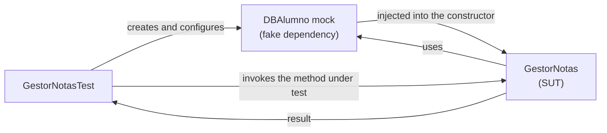

# Tutorial: codeurjc-slidev

---

# Starting a new project
- Create a presentation with the CodeURJC theme
- The theme and the scaffolding CLI are published on npm:
    - [`codeurjc-slidev-theme`](https://www.npmjs.com/package/codeurjc-slidev-theme) — the theme itself (`theme: codeurjc-slidev-theme`)
    - [`create-codeurjc-slidev`](https://www.npmjs.com/package/create-codeurjc-slidev) — a CLI that scaffolds a new project from scratch

---

# Starting a new project: steps
```sh
pnpm create codeurjc-slidev my-talk
cd my-talk
pnpm install
pnpm dev
```
- The CLI asks for the project name (if not passed as an argument) and whether to install dependencies and start the dev server
- It generates a minimal, self-contained project: `package.json`, `slides.md`, an empty `code/` directory, and `public/images/logo.png`
- Also works with `npm create codeurjc-slidev` or `yarn create codeurjc-slidev`

---

# The CodeURJC theme
- Every slide gets the CodeURJC look for free: red bar, logo, and title styling, with no setup beyond `theme: codeurjc-slidev-theme`
- Comes with an `urjc-red` / `urjc-green` UnoCSS color preset, so custom elements you add can match the theme's palette
- The rest of this tutorial covers the authoring features layered on top of that base theme

---

# Inherited titles and subtitles
- On a slide using the `default` layout, if it doesn't start with `# Title`, that title is inherited from the nearest preceding slide that set one
- The subtitle (`## ...`) is inherited the same way, but **independently**: a slide can change only the subtitle and keep the title, or vice versa
- Avoids retyping the same `# Title` on every slide of a section
- A slide with a different layout (e.g. `cover`) doesn't interrupt inheritance: it's skipped over when looking for the previous slide

---

# Inherited titles: cutting the chain
- An empty heading (bare `#` or `##`, no text) cuts inheritance from that slide onward, until another slide sets a new title/subtitle
- `resetTitle: true` in a slide's frontmatter cuts **both** chains (title and subtitle) at once, without writing the empty headings

---

# Title inheritance
## Example: first part
- This slide sets the title ("Title inheritance") and the subtitle ("Example: first part")
- The next slide in this same file doesn't repeat `# Title inheritance`

---

## Example: second part
- Notice the title of this slide: it's still "Title inheritance", inherited from the previous one
- Only `## Example: second part` was written — the title wasn't retyped

---

# Auto-fit text size
- A slide's content automatically adjusts its font size to fit the content box
- If the text fits comfortably, a default comfortable size is kept (it doesn't grow needlessly)
- If the text is too long, it shrinks progressively until it fits
- It's recalculated whenever the content box's size changes (e.g. when dragging it in the editor)

---

# Pasting and positioning images
- Paste an image (Ctrl+V) directly onto a slide in edit mode
- The image is uploaded automatically and inserted as `` in the slide's markdown — no manual asset pipeline
- You can choose the image's position relative to the content:
    - **Below** the text (`below`): the image is centered under the content
    - **To the right** of the text (`right`): the content narrows to make room for the image
- The image is just another element in the layout editor: it can be dragged, resized, and its position is saved like everything else

---

# Centered mermaid diagrams
- ` ```mermaid ` blocks are centered and use a readable default width in the `default` layout, with no extra markup needed on each slide

---

# Mermaid diagrams: example


---

# Double-click to edit text
- Double-click a slide's already-rendered title or content
- The editor automatically jumps to that slide's markdown and selects the clicked text
- Lets you go straight from "I see a mistake on this slide" to "I'm editing it", without manually hunting for the line in the markdown

---

# Code annotations: callouts
- Mark a line, a line range, or a substring inside a fenced code block
- Each mark can carry a comment that renders as a callout box connected to the code by an elbow connector
- Marks are written as a trailing comment on the code line and **are stripped from the rendered code**: the audience never sees them

---

# Code annotations: syntax
```
// [!mark[:start|:end][(<start>-<end>)][@<x>,<y>]] <comment>
```
- No id needed: marks aren't referenced by anything else, so none is written (one is generated internally, for internal use only)
- `<comment>`: everything after the `]`; if left empty, the line is still highlighted but no box appears
- Available forms:
    - Whole line: `// [!mark] comment`
    - Multi-line range: `// [!mark:start]` ... `// [!mark:end]`
    - Substring: `// [!mark(<start>-<end>)] comment`, with `<start>`/`<end>` as character indices (0-based, end-exclusive) into the code line
    - Fixed position: `@x,y` right before the `]` (written automatically when you drag the callout in the editor)

---

# Code annotations: example
```java
public GestorNotas(DBAlumno alumnos) { // [!mark] Injects the database dependency
	this.alumnos = alumnos;              // [!mark(1-13)] Just the substring
}

public float calculaNotaMedia(long idAlumno) {
	List<Float> notas = alumnos.getNotasAlumno(idAlumno); // [!mark(29-53)] Fetches the student's grades
	float suma = 0.0f; // [!mark:start] Loops through the grades to sum them
	for(float nota : notas) {
		suma += nota;
	}
	return suma / notas.size(); // [!mark:end]
}
```

---

# Code annotations: placement and dragging
- Callouts are placed automatically around the code block: **right → left → below → above**, the first side that fits
- They're sized according to the comment text (with a max width, growing taller if needed)
- If a side is already occupied by another callout on the same block, the new one stacks next to the closest free spot to its own highlight
- In edit mode, dragging a callout writes its position as `@x,y` into the mark, so it persists across reloads and survives later edits to the code above it

---

# Importing code from files
- Reference a file from the `code/` directory (real, runnable exercise/example projects) directly on a slide
- The file is read live and **re-rendered whenever it changes**
- The referenced file stays completely clean: no mark or slide-only syntax is ever added to it

---

# Importing code: syntax
```
<<< @/code/path/to/File.java[selector] lang
```
- No selector: shows the whole file
- `[N-M]`: absolute line range (1-based, both inclusive)
- `["first line".."last line"]`: content range — from the line containing the first text through the line containing the second, both inclusive
    - If either anchor isn't found, the whole file is shown instead (with a console warning)
- There's a "code root" convention (`code/` by default): an import resolving outside it only produces a console warning, it doesn't break the build
- The code block automatically shows a title bar with the file's name (e.g. `GestorNotas.java`)
    - To hide it, add `notitle` after the language: `<<< @/code/path/to/File.java[selector] lang notitle`

---

# Importing code: highlights via anchors
- The imported file can't carry `// [!mark]` comments, so highlights are declared in `slides.md`, right below the `<<<` import, one per line
- They target the already-sliced snippet (as shown on the slide), not the whole file:
    - `[!mark:N] comment` — line `N`
    - `[!mark:N..M] comment` — line range
    - `[!mark:"text"] comment` — the substring `text` (literal search)
    - `[!mark:"text"(<start>-<end>)] comment` — substring `[<start>, <end>)` of the matched line
    - `[!mark:"a".."b"] comment` — from the line containing `a` through the line containing `b`
    - `[!mark:"a"+N] comment` — from the line containing `a` through `N` lines after it
    - `#N` / `#*` at the end of a content anchor: picks the Nth occurrence, or highlights every occurrence
- Just like inline marks, `@x,y` pins the position and is written automatically when dragging the callout

---

# Importing code: example
```
<<< @/code/ejer8/src/main/java/es/codeurjc/test/gestor/GestorNotas.java[7-24] java
[!mark:"public GestorNotas(DBAlumno alumnos)"] Injects the database dependency
[!mark:"getNotasAlumno(idAlumno)"] Fetches the student's grades
[!mark:"float suma = 0.0f;".."return suma / notas.size();"] Loops through the grades to sum them
```
- Shows lines 7 to 24 of `GestorNotas.java` exactly as they are in the real project
- The three highlights and their callouts are computed over that fragment, without touching the source file
- The title bar ("GestorNotas.java") appears on its own, with nothing extra written on the slide

---

# Visual layout editor
- Slides using the `default` layout also have an editing layer built into Slidev's **SideEditor** panel (the "Layout" tab), for the occasional case where the defaults don't fit
- Drag and resize the red bar, the logo, the title, and the content, with undo support before saving
- Saving persists the position as CSS variables in the layout's own `.vue` file, or you can save it as a new `.vue` layout

---
layout: copyright
---

# Tutorial: codeurjc-slidev
